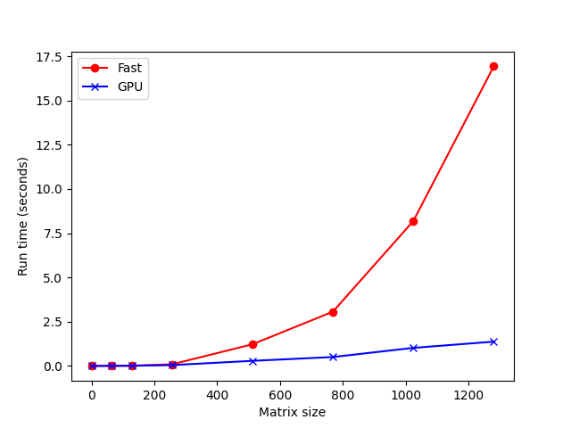

# MiniTorch Module 3


* Docs: https://minitorch.github.io/

* Overview: https://minitorch.github.io/module3.html


You will need to modify `tensor_functions.py` slightly in this assignment.

* Tests:

```
python run_tests.py
```

* Note:

Several of the tests for this assignment will only run if you are on a GPU machine and will not
run on github's test infrastructure. Please follow the instructions to setup up a colab machine
to run these tests.

This assignment requires the following files from the previous assignments. You can get these by running

```bash
python sync_previous_module.py previous-module-dir current-module-dir
```

The files that will be synced are:

        minitorch/tensor_data.py minitorch/tensor_functions.py minitorch/tensor_ops.py minitorch/operators.py minitorch/scalar.py minitorch/scalar_functions.py minitorch/module.py minitorch/autodiff.py minitorch/module.py project/run_manual.py project/run_scalar.py project/run_tensor.py minitorch/operators.py minitorch/module.py minitorch/autodiff.py minitorch/tensor.py minitorch/datasets.py minitorch/testing.py minitorch/optim.py

# Task 3.4 Performance


*Performance comparison showing execution time between Fast CPU (red) and GPU (blue) implementations for matrix multiplication with increasing matrix sizes*


# Task 3.5 Training Results

## Simple

### Fast (CPU)

- Hidden: 100
- Learning Rate: 0.05

Epoch|Loss|Correct
---|---|---
0|5.183147992|41
10|2.006881006|49
20|2.069937409|49
30|0.5863635469|49
40|1.452448572|49
50|0.3110547472|49
60|0.4185370148|49
70|0.6771303265|49
80|0.5118949833|49
90|0.2767845558|50
100|0.7704364863|50
110|0.06864466411|50
120|0.9866397891|50
130|0.2727201438|50
140|0.1353256067|50
150|0.03040099753|50
160|1.045750144|49
170|0.02788914214|50
180|0.1178521504|50
190|0.07043705647|50
200|0.629406955|50
210|0.1057739743|50
220|0.08908092271|50
230|0.03230743921|50
240|1.002573325|50
250|0.50334627|50
260|0.01217520156|50
270|0.04157440544|50
280|0.007655597035|50
290|0.4375375907|50
300|0.01417541761|50
310|0.001253660116|50
320|0.01574114688|50
330|0.01248749147|50
340|0.4455836424|50
350|0.1474577889|50
360|0.4555137851|50
370|0.3884117999|50
380|0.5202511626|50
390|0.3584482185|50
400|0.0918554724|50
410|0.04560296694|50
420|0.1980824042|50
430|0.003144781807|50
440|0.01154478271|50
450|0.3886403031|50
460|0.000818495419|50
470|0.1779788747|50
480|0.298070195|50
490|0.3229422032|50

### GPU

- Hidden: 100
- Learning Rate: 0.01

Epoch|Loss|Correct
---|---|---
0|5.809264861|39
10|2.048606279|48
20|1.519921271|49
30|1.675174859|50
40|1.643199942|50
50|1.052151287|50
60|1.481459855|50
70|1.173704446|50
80|1.170627244|50
90|0.8470480841|50
100|0.6882103293|50
110|0.8644310915|50
120|1.285718963|50
130|0.9843193718|50
140|0.7646657301|50
150|0.6698233339|50
160|1.083846367|50
170|0.8250878406|50
180|0.09774261604|50
190|0.3765100331|50
200|0.8183113561|50
210|0.07129557384|50
220|0.431866608|50
230|0.6961247589|50
240|0.1739085951|50
250|0.07931649621|50
260|0.3326733248|50
270|0.7335481882|50
280|0.8100440645|50
290|0.2414272814|50
300|0.7658576178|50
310|0.3480517281|50
320|0.5006124042|50
330|0.3071422914|50
340|0.1769691282|50
350|0.04731690217|50
360|0.5538661735|50
370|0.5767271169|50
380|0.04709981398|50
390|0.9738980188|50
400|0.6501300661|50
410|0.05533086926|50
420|0.3614379459|50
430|0.1691490183|50
440|0.5080871144|50
450|0.7079013935|50
460|0.230274051|50
470|0.6329263035|50
480|0.2646207037|50
490|0.3777088517|50

## Split

### Fast (CPU)
- Hidden: 100
- Learning Rate: 0.05

Epoch|Loss|Correct
---|---|---
0|6.85956399|30
10|4.977850826|41
20|4.660836699|37
30|4.893449374|43
40|4.588566103|48
50|3.338016835|49
60|2.921386467|47
70|2.845455446|49
80|2.361650695|47
90|2.513458846|44
100|1.289247675|50
110|2.34706356|48
120|0.7966038635|49
130|2.095222211|48
140|2.142269325|44
150|1.923991438|50
160|2.275182016|49
170|1.211060485|50
180|2.872514041|50
190|0.7920737853|50
200|1.383167381|50
210|2.126805587|50
220|2.995781332|47
230|1.500281381|50
240|1.836518686|50
250|1.62917353|48
260|1.549083693|50
270|1.024334395|50
280|0.5788142348|50
290|2.336578484|50
300|1.357966617|50
310|0.8389680395|50
320|1.400883696|50
330|0.4714169275|50
340|0.3487766546|49
350|1.177574888|49
360|0.6823810714|50
370|1.805249559|50
380|0.17747606|49
390|0.7266019848|50
400|0.6140351929|50
410|0.5551846677|50
420|0.5941607145|50
430|0.9065531846|50
440|0.8224411073|50
450|0.3189156756|49
460|0.1887757494|49
470|0.140387459|50
480|1.840276808|50
490|0.5817390929|50

### GPU
- Hidden: 100
- Learning Rate: 0.05

Epoch|Loss|Correct
---|---|---
0|5.683762087|32
10|3.487924676|43
20|5.373540871|42
30|4.677735676|44
40|3.212549686|46
50|2.706751889|46
60|2.42845748|48
70|2.390780224|49
80|1.998732439|47
90|2.213281715|49
100|1.590470459|50
110|1.721910549|49
120|0.5993762434|49
130|0.6517542508|50
140|1.288626735|50
150|1.429527638|49
160|0.5117240247|48
170|1.613304023|48
180|1.245613826|49
190|1.115668655|50
200|0.3387142119|50
210|0.6880020961|50
220|2.17399776|47
230|0.6255060921|50
240|0.4776187995|50
250|1.213305988|50
260|0.8546643635|50
270|1.427916971|49
280|0.3659060001|49
290|0.5815064868|50
300|0.3243066116|50
310|0.5416671855|50
320|1.645580848|48
330|0.3567352612|50
340|1.083129702|50
350|0.2109481137|50
360|0.4172372164|50
370|0.4443090069|50
380|0.2071719479|50
390|0.2294312236|50
400|0.5245797534|50
410|0.04097977059|50
420|0.07390725713|50
430|0.09729824908|50
440|0.5440881918|50
450|0.1949956105|50
460|0.2820969219|50
470|0.6269811281|50
480|0.4545980416|50
490|0.3445936414|50

## XOR

### Fast (CPU)

- Hidden: 100
- Learning Rate: 0.05

Epoch|Loss|Correct
---|---|---
0|6.507335105|32
10|3.737375441|44
20|1.915978687|48
30|3.932262825|46
40|2.565735838|50
50|1.644499615|48
60|2.353152406|47
70|1.423468857|49
80|2.47834959|48
90|1.012508531|50
100|1.659269687|49
110|0.8634472289|49
120|2.037713365|50
130|0.7259646634|49
140|0.8856164961|49
150|0.955973419|49
160|0.9973599615|50
170|1.530619865|50
180|0.426614713|50
190|0.1735001221|50
200|0.8447484202|50
210|0.4409387842|50
220|0.2934022721|50
230|0.7518833954|50
240|0.700402582|50
250|0.8593544181|50
260|0.3928658568|50
270|0.1772091011|50
280|0.4621756901|50
290|0.1521182396|50
300|0.4031963617|50
310|0.6897646743|50
320|0.1400317955|50
330|0.2558331354|50
340|0.1749482446|50
350|0.3298142049|50
360|0.1220415408|50
370|0.04258274028|50
380|0.1893042415|50
390|0.4068000962|50
400|0.4741540028|50
410|0.2044835019|50
420|0.1046334338|50
430|0.0948726311|50
440|0.07072209719|50
450|0.1736008839|50
460|0.2813472819|50
470|0.113802094|50
480|0.1284202241|50
490|0.2156106381|50

### GPU

Hidden: 100
Learning Rate: 0.05

Epoch|Loss|Correct
---|---|---
0|7.413267881|23
10|4.225882467|43
20|2.672725719|45
30|2.884055881|47
40|4.572642827|42
50|4.633493097|46
60|1.629983886|45
70|2.52660384|45
80|2.082247036|48
90|2.223015581|47
100|1.785409569|48
110|0.8142699756|48
120|0.6873832164|48
130|1.529018701|45
140|2.305501096|49
150|1.61620122|49
160|1.586659968|49
170|1.573920475|48
180|0.5738460902|49
190|0.2873111967|50
200|0.6292005509|48
210|1.362497412|49
220|2.255620562|49
230|1.015816584|49
240|1.025305239|50
250|1.32981842|49
260|1.939630803|49
270|0.4439616595|49
280|0.3281999197|50
290|0.2504660719|49
300|1.020054111|49
310|0.8167229005|49
320|0.9610491689|49
330|0.1382765349|49
340|1.478419079|49
350|0.8184105152|49
360|1.350380874|49
370|0.3982806739|49
380|0.6623894998|49
390|0.4831676146|50
400|0.1922058959|49
410|0.7754252698|49
420|0.264851796|49
430|0.2977891356|50
440|1.278263641|49
450|0.5010034164|50
460|0.1364420106|49
470|0.007205155934|49
480|0.2504399893|49
490|0.3981666473|49